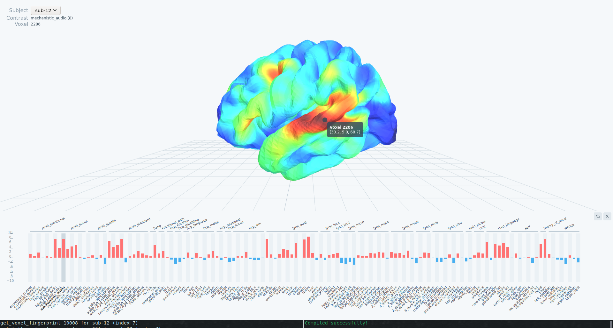

# Brain cockpit


`brain-cockpit` is a Typescript and Python application meant to help explore fMRI datasets.
It comes as a React application making calls to Python functions through an [`eel`](https://github.com/samuelhwilliams/Eel) server.

For now, it consists of a sole view to help looking at IBC contrasts projected on `fsaverage`. Key features include selecting subject, selecting contrast, and clicking on voxel to display its functional fingerprint.



## Install

### Dependencies

```
yarn install
conda env create -f environment.yml
```

Once the `conda` environment is created, activate it with

```
conda activate brain-cockpit
```

### Generate assets (3D meshes)

This command generates `fsaverage` meshes from `nilearn` and stores them in `./public/assets`

```
python3 gifty_to_gltf.py
```

### Download IBC contrasts

Projected contrasts are available at `/storage/store2/work/athual/data/ibc_surface_conditions_db.zip`. You most likely want to download and unzip this archive locally:

```
scp username@drago2:/storage/store2/work/athual/data/ibc_surface_conditions_db.zip /path/to/archive
unzip /path/to/ibc_surface_conditions_db.zip
```

Finally, make a copy of the app's config file

```
cp .env.example .env
```

and edit it such that the variable `DATA_PATH` now points to your unzipped folder containing IBC data.

## Run

### Dev mode

In separate prompts:

- start the frontend with `yarn start`
- start the backend with `python3 main.py` (using your `brain-cockpit` conda env)

## Contributing

Commits must validate a pre-commit routine launched by a git hook.
To enable this hook locally, run

```
pre-commit install
```
